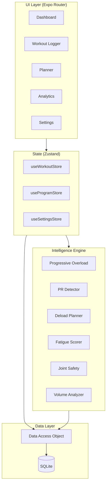

<div align="center">


# TrueFit

### Intelligent and algorithmic strength training companion — progressive overload, fatigue management, and personal records, all offline.

[](https://expo.dev)
[](https://docs.expo.dev/versions/latest/sdk/sqlite/)
[](https://github.com/pmndrs/zustand)
[](https://developer.android.com)
[]()

**84** exercises · **8** training engines · **100%** offline · **0** subscriptions

</div>

---

## The Problem

Existing gym tracking apps fall into two categories:

**Category 1 — Simple loggers.** Just a spreadsheet with extra steps. You write down what you lifted, and that's it. No intelligence. No feedback. You're still guessing whether to add weight next week.

**Category 2 — Over-engineered platforms.** $15/month subscriptions, mandatory accounts, cloud sync you don't need, social features, and workout "plans" that are just static PDFs. They solve a simple problem with a complex product.

**Neither tells you:** *"Hey, you hit 12 reps on all sets last week — bump the weight up by 2.5kg"* or *"You've been training hard for 5 straight weeks, take a deload before your joints pay for it."*

**TrueFit sits in between.** A fully offline, zero-subscription training app that actually thinks for you — progressive overload recommendations, fatigue-based deload planning, joint safety warnings, PR detection, and weekly volume analysis. All running locally on your phone with SQLite. No server. No account. No internet required.

---

## Screenshots

> Screenshots from Android build running on emulator

| Dashboard | Workout Logging | Analytics | Planner |
|-----------|----------------|-----------|---------|
| Weekly stats, fatigue gauge, deload alerts, and training recommendations | Ghost data from last session, overload recommendations, and safety warnings | Volume trends, workout frequency, consistency metrics, and PR timeline | Create programs, choose templates, configure exercises and targets |

---

## Architecture

```
TrueFit/
├── app/                    # Expo Router screens (file-based routing)
│   ├── _layout.js          # Root tab navigator
│   ├── index.js            # Dashboard
│   ├── analytics.js        # Charts and data visualization
│   ├── settings.js         # App settings and data management
│   ├── log/
│   │   ├── index.js        # Workout day selector + log history
│   │   └── [logId].js      # Active workout logging screen
│   └── planner/
│       ├── index.js        # Program list and creation
│       └── [programId].js  # Edit program days and exercises
│
├── src/
│   ├── engine/             # 🧠 The intelligence layer (8 modules)
│   │   ├── progressiveOverload.js   # Weight/rep recommendation engine
│   │   ├── prDetector.js            # Personal record detection
│   │   ├── deloadPlanner.js         # Fatigue-based deload scheduling
│   │   ├── fatigue.js               # Weekly fatigue scoring
│   │   ├── jointSafety.js           # Weight jump safety validation
│   │   ├── volumeAnalyzer.js        # Muscle group volume tracking
│   │   ├── progressAnalyzer.js      # Consistency and trends
│   │   └── weeklyReport.js          # Weekly training summaries
│   │
│   ├── db/
│   │   ├── database.js     # SQLite singleton (expo-sqlite)
│   │   ├── dao.js          # Data access layer (all queries)
│   │   └── seed.js         # 84 exercises + default settings
│   │
│   ├── stores/             # Zustand state management
│   │   ├── useWorkoutStore.js    # Active logging session
│   │   ├── useProgramStore.js    # Programs and days
│   │   ├── useSettingsStore.js   # User preferences
│   │   └── useUIStore.js         # Toast notifications
│   │
│   ├── components/         # Reusable UI components
│   │   ├── ExerciseCard.js       # Exercise display with ghost data
│   │   ├── ExercisePicker.js     # Searchable exercise selector
│   │   ├── SetRow.js             # Individual set input row
│   │   ├── StatCard.js           # Dashboard stat cards
│   │   ├── FatigueGauge.js       # Visual fatigue meter
│   │   ├── VolumeBar.js          # Muscle volume progress bars
│   │   ├── WeeklyReportCard.js   # Weekly summary card
│   │   ├── Toast.js              # Notification toasts
│   │   └── EmptyState.js         # Empty state placeholders
│   │
│   ├── theme/theme.js      # Design tokens (dark theme)
│   └── utils/              # Calculations, dates, constants
│
└── android/                # Native Android build output
```



---

## The Intelligence Engine

This is the core of TrueFit — **8 modules** that analyze your training data and give real-time feedback. Every module is functionally pure (data in, recommendation out) with zero side effects.

### Progressive Overload Advisor

Compares your last session against program targets and recommends next steps:

| Last Session vs Target | Recommendation | Example |
|----------------------|----------------|---------|
| All sets hit **max** reps at target weight | **Increase weight** | 40kg×12,12,12 → "Increase to 42.5kg" |
| All sets hit **min** reps at target weight | **Increase reps** | 40kg×8,8,9 → "Aim for more reps at 40kg" |
| Weight below target but reps are solid | **Increase weight toward target** | 37.5kg×11,11,11 → "Increase to 40kg" |
| Some sets hit, some didn't | **Maintain** | 40kg×10,8,6 → "Repeat and aim for consistency" |
| No sets met minimum | **Reduce weight** | 40kg×5,4,5 → "Consider reducing to 37.5kg" |

### Deload Planner

Tracks consecutive training weeks and recommends deload periods. After 5 weeks of consistent training, it prompts: *"Apply deload reductions?"* — automatically dropping weight and volume. Completing all deload days resets the cycle.

### Joint Safety Validator

Flags dangerous weight jumps in real-time:
- **>30% jump** on compounds (squat, bench, deadlift) → ⚠️ caution
- **>20% jump** on isolations → ⚠️ caution
- **>50% jump** on anything → 🛑 danger

### PR Detector

Automatically detects personal records after every workout across three categories:
- **Weight PR** — heaviest weight lifted
- **Estimated 1RM PR** — calculated via Epley formula
- **Rep PR** — most reps at any weight

Deduplicates by finding the single best per category per exercise (no spam).

### Volume Analyzer

Tracks weekly sets per muscle group against evidence-based optimal ranges (10-20 sets/week). Flags under-training and over-training per muscle.

### Fatigue Scorer

Analyzes training density and volume trends to produce a 0-100 fatigue score displayed as a gauge on the dashboard.

---

## Key Features

**Workout Planning**
- Create custom programs with unlimited days
- Pre-built templates (Push/Pull/Legs, Upper/Lower, Full Body, Bro Split)
- Configure per-exercise targets: sets, rep range, and target weight
- 84 exercises across 13 muscle groups with proper categorization

**Workout Logging**
- Ghost data — see exactly what you lifted last time
- Smart recommendations appear before you start logging
- New sets auto-fill from previous set's weight/reps
- Delete individual sets by tapping the set icon
- Deload mode with automatic weight/volume reduction
- Read-only view of past workouts

**Analytics**
- Volume over time (weekly bar charts)
- Workout frequency tracking
- Consistency score and streak tracking
- Muscle group volume distribution
- PR timeline with history

**Data & Privacy**
- 100% offline — SQLite on device, zero network calls
- Export-ready data (all in one local database)
- No account, no login, no tracking, no ads

---

## Tech Stack

| Layer | Technology | Why |
|-------|-----------|-----|
| Framework | React Native + Expo SDK 56 | Cross-platform with native performance |
| Routing | Expo Router (file-based) | Type-safe, intuitive navigation |
| Database | expo-sqlite | Full SQL locally, zero latency |
| State | Zustand | Lightweight, no boilerplate |
| Charts | react-native-gifted-charts | Native SVG chart rendering |
| Animations | react-native-reanimated | 60fps animations on UI thread |
| Haptics | expo-haptics | Tactile feedback on PRs and warnings |
| Theme | Custom design tokens | Premium dark theme with electric cyan (#00d4ff) |

---

## Data Models

**Programs & Exercises**
```sql
programs(id, name, is_active, created_at)
program_days(id, program_id, name, day_index)
program_exercises(id, day_id, exercise_id, target_sets, target_reps_min,
                  target_reps_max, target_weight, sort_order)
exercises(id, name, muscle_group, secondary_muscles, category, equipment,
          default_increment)
```

**Workout Logs**
```sql
workout_logs(id, program_id, day_id, date, bodyweight, notes, created_at)
log_exercises(id, log_id, exercise_id, notes, sort_order)
log_sets(id, log_exercise_id, set_number, weight, reps, rpe)
```

**Personal Records & Settings**
```sql
personal_records(id, exercise_id, type, value, reps, estimated_1rm, date)
settings(key, value)  -- weight_unit, deload_frequency, fatigue_threshold
```

---

## How the Overload Engine Works

The core progression loop that runs every time you open a workout:

```
┌─────────────────────────────────────────────┐
│  1. Load last session for this exercise     │
│     (ghost data: weight × reps per set)     │
├─────────────────────────────────────────────┤
│  2. Compare against program targets         │
│     evaluatePerformance() →                 │
│     exceeded | met | below_weight |         │
│     partial | failed                        │
├─────────────────────────────────────────────┤
│  3. Generate recommendation                 │
│     ↑ weight | ↑ reps | maintain | ↓ weight │
├─────────────────────────────────────────────┤
│  4. Display as colored badge on exercise    │
│     Green = increase | Yellow = maintain    │
│     Blue = progress toward target           │
│     Red = reduce                            │
├─────────────────────────────────────────────┤
│  5. After saving: detect PRs, check         │
│     deload cycle, update fatigue score      │
└─────────────────────────────────────────────┘
```

---

## Running Locally

### Prerequisites
- Node.js 18+
- Android Studio with SDK 35+ and an emulator
- Java 17 (for Gradle builds)

### Setup
```bash
git clone https://github.com/yourusername/TrueFit.git
cd TrueFit
npm install
```

### Development
```bash
# Start Metro bundler
npx expo start

# Or run directly on Android emulator
npx expo run:android
```

### Production Build
```bash
# Generate APK
cd android
./gradlew assembleRelease
```

---

## Design Philosophy

1. **Offline-first** — No server, no account, no sync. Your training data stays on your device. Period.
2. **Intelligence, not complexity** — The app should think for you. You log sets; it tells you what to do next.
3. **Zero friction logging** — Ghost data + auto-fill + smart defaults = fastest possible logging flow.
4. **Evidence-based engine** — Overload recommendations follow double progression methodology. Volume targets based on established sports science ranges (Schoenfeld, Israetel).
5. **Premium dark aesthetic** — Not a white-background spreadsheet. Electric cyan on deep navy with smooth animations.

---

## What I Learned

- **SQLite architecture** — Designed a normalized relational schema for training data with proper foreign keys, cascading deletes, and efficient query patterns through a centralized DAO layer
- **State management patterns** — Used Zustand stores to coordinate complex multi-step workflows (workout logging → PR detection → deload evaluation → UI feedback)
- **Algorithm design** — Built a multi-factor progressive overload engine that handles edge cases like below-target-weight progression, rep range evaluation, and fatigue-based periodization
- **Performance on mobile** — Managed N+1 query patterns in SQLite, optimized list renders with proper key management, and used Reanimated for thread-offloaded animations

---

## What's Next

- [ ] Workout duration tracking (start/finish timestamps)
- [ ] Exercise swap suggestions during workout (same muscle group alternatives)
- [ ] Plateau detection surfaced on exercise cards
- [ ] Body measurement tracking (weight, measurements over time)
- [ ] Export training data as CSV
- [ ] EAS Build for Play Store distribution

---

## Built By

**Kapish** — B.Tech CSE, VIT University

Solo-designed and built.

---

<div align="center">

**Fully offline · Zero subscriptions · Built with Expo SDK 56 + SQLite**

</div>
